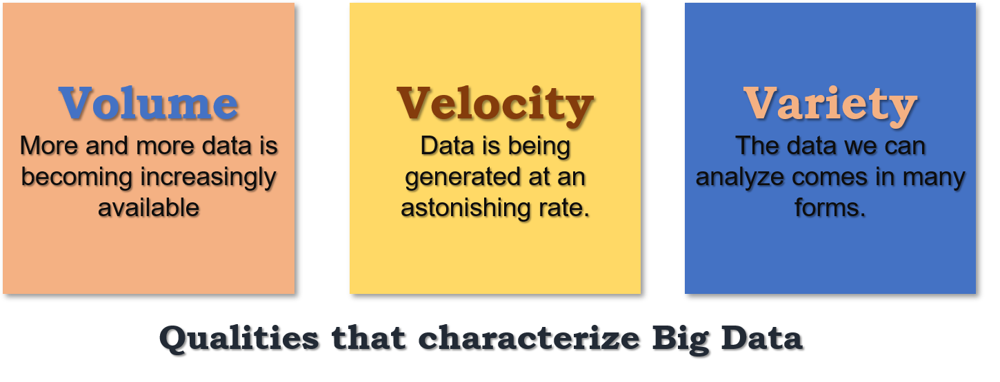
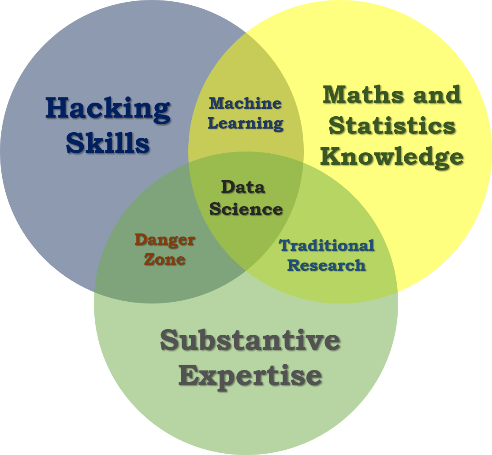
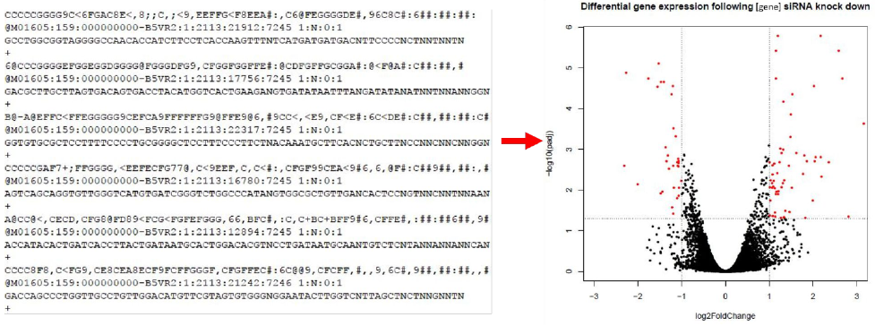
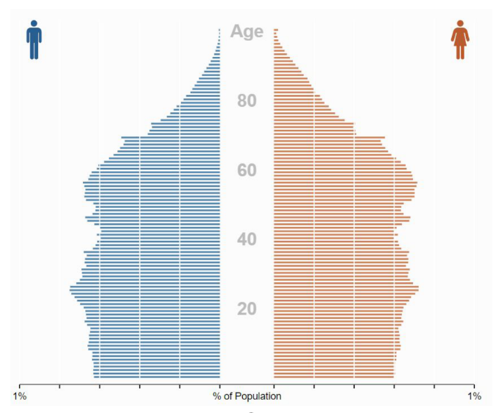

# Welcome to the Data Scientist's Toolbox

## What is Data Science?

- To different people this means different things, but at its core, data science is using data to answer questions.
- Data Science can Involve:
  - Statistics, Computer Science, Mathematics
  - Data Cleaning and Formatting
  - Data Visualization

- [An Economist Special Report](http://www.economist.com/node/15557443) sums up this melange of skills well by stating that a data scientist is broadly defined as someone:

  > who combines the skills of software programmer, statistician and story teller or artist to extract the nuggets of gold hidden under mountains of data 

## Why do we need Data Science?

- One of the reasons for the [rise of data science](https://www.forbes.com/sites/gilpress/2013/05/28/a-very-short-history-of-data-science/#2caa3a5055cf) in recent years is the vast amount of data currently available and being generated. Not only are massive amounts of data being collected about many aspects of the world and our lives, but we simultaneously have the rise of inexpensive computing. This has created the perfect storm in which we have rich data and the tools to analyse it: Rising computer memory capabilities, better processors, more software and now, more data scientists with the skills to put this to use and answer questions using this data!

- There is a little anecdote that describes the truly exponential growth of data generation we are experiencing. In the third century BC, the Library of Alexandria was believed to house the sum of human knowledge. Today, there is enough information in the world to give every person alive 320 times as much of it as historians think was stored in Alexandria’s entire collection.

And that is still growing.

## Big Data

- The Big Data can be summarized as follows:

  

## What is a Data Scientist?

- The most basic definition would be that a data scientist is somebody who uses data to answer questions. But here more important is the skills embodied by a data scientist. The following  [illustrative Venn diagram](http://drewconway.com/zia/2013/3/26/the-data-science-venn-diagram) defines the data science is the intersection of three sectors: Substantive Expertise, Hacking Skills and Math and Statistics:

  

- One reason data scientists are in such demand is that most of the answers aren’t already outlined in textbooks - a data scientist needs to be somebody who knows how to find answers to novel problems.

## Why do Data Science?

- Speaking of that demand, there is a huge need for individuals with data science skills. Not only are machine learning engineers, data scientists, and big data engineers among the top emerging jobs in 2017 [according to LinkedIn](https://economicgraph.linkedin.com/research/LinkedIns-2017-US-Emerging-Jobs-Report), the demand far exceeds the supply.

  > Data scientist roles have grown over 650 percent since 2012, but currently 35,000 people in the US have data science skills, while hundreds of companies are hiring for those roles - even those you may not expect in sectors like retail and finance - supply of candidates for these roles cannot keep up with demand.

- This is a great time to be getting in to data science - not only do we have more and more data, and more and more tools for collecting, storing, and analyzing it, but the demand for data scientists is becoming increasingly recognized as important in many diverse sectors, not just business and academia.
- Additionally, according to [Glassdoor](https://www.glassdoor.com/List/Best-Jobs-in-America-LST_KQ0,20.htm), in which they ranked the top 50 best jobs in America, Data Scientist is **THE** top job in the US in 2017, based on job satisfaction, salary, and demand.

## Some Famous Data Scientists

    <table>
        <tr>
        	<td></td>
            <td style="width:500px; line-height:24px; text-align:justify">One place we might not immediately recognize the demand for data science is in sports – <a href="https://twitter.com/dmorey">Daryl Morey</a> is the general manager of a US basketball team, the Houston Rockets. <a href="http://www.nytimes.com/2008/01/28/sports/basketball/28morey.html">Despite not having a strong background in basketball</a>, Morey was awarded the job as GM on the basis of his bachelor’s degree in computer science and his M.B.A. from M.I.T. He was chosen for his ability to collect and analyse data, and use that to make informed hiring decisions.</td>
        </tr>
        <tr>
        	<td></td>
            <td style="width:500px; line-height:24px; text-align:justify">Another data scientist that you may have heard of is <a href="https://hilarymason.com/">Hilary Mason</a>. She is a co-founder of FastForward labs, a machine learning company recently acquired by Cloudera, a data science company, and is the Data Scientist in Residence at Accel. Broadly, she uses data to answer questions about mining the web and understanding the way that humans interact with each other through social media.</td>
        </tr>
       	<tr>
        	<td>
            	
            </td>
            <td style="width:500px; line-height:24px; text-align:justify">And finally, Nate Silver is one of the most famous data scientists or statisticians in the world today. He is founder and editor in chief at <a href="http://fivethirtyeight.com/">FiveThirtyEight</a> - A website that   <h5 style="margin-bottom:15px; font-size:18px; line-height:24px;">uses statistical analysis - hard numbers - to tell compelling stories about elections, politics, sports, science, economics and lifestyle.</h5>
He uses large amounts of totally free public data to make predictions about a variety of topics; most notably he makes predictions about who will win elections in the United States, and has a remarkable track record for accuracy doing so.
            </td>
        </tr>
    </table>

### **Data Science in Action**

- One great example of data science in action is from 2009, in which researchers at Google analysed 50 million commonly searched terms over a five year period, and compared them against CDC data on flu outbreaks. Their goal was to see if certain searches coincided with outbreaks of the flu. 
- One of the benefits of data science and using big data is that it can identify correlations; in this case, they identified 45 words that had a strong correlation with the CDC flu outbreak data. 
- With this data, they have been able to predict flu outbreaks based solely off of common Google searches! Without this mass amounts of data, these 45 words could not have been predicted beforehand.

# What is Data?

- Data definition by

  1. [Cambridge English Dictionary](https://dictionary.cambridge.org/dictionary/english/data):

     > Information, especially facts or numbers, collected to be examined and considered and used to help decision-making.

  2.  [Wikipedia](https://en.wikipedia.org/wiki/Data):

     > A set of values of qualitative or quantitative variables.

  - Exploring definition by Wikipedia:
    - **Set**: In statistics, the population we are trying to discover something about.
    - **Variable**: Measurements or characteristics of an item.
    - **Qualitative Variable**: Measurements or information about qualities.
    - **Quantitative Variable**: Measurements or information about quantities or numerical items.

## What Data can look like?

| Name      | Country of Origin | Sex    | Weight(kg) | Height(cm) |
| --------- | ----------------- | ------ | ---------- | ---------- |
| A. Bee    | Canada            | Male   | 75         | 163        |
| C. Dee    | UAE               | Male   | 80         | 180        |
| E. Eff    | China             | Female | 72         | 175        |
| G. Haitch | South Africa      | Female | 68         | 172        |
| I. Jay    | Poland            | Male   | 77         | N/A        |
| K. Elle   | Japan             | N/A    | 76         | 173        |
| M. Enn    | Chile             | Male   | 80         | 190        |

- The data presented above are very rare in reality the datasets are much more messier than the above format.

## Most common types of Messy Data

#### 1. Sequencing

- This data is generally first encountered in the FASTQ format, the raw file format produced by sequencing machines. 

- These files are often hundreds of millions of lines long, and it is our job to parse this into an understandable and interpretable format and infer something about that individual’s genome. 

- In this case, this data was interpreted into expression data, and produced a plot called a “volcano plot”.

  

#### 2. Census Information

#### Electronic medical records (EMR)

- Electronic medical records are increasingly prevalent as a way to store health information, and more and more population based studies are using this data to answer questions and make inferences about populations at large, or as a method to identify ways to improve medical care. For example, if you are asking about a population’s common allergies, you will have to extract many individuals’ allergy information, and put that into an easily interpretable table format where you will then perform your analysis.

#### Image analysis/extrapolation

- A more complex data source to analyse are images/videos. There is a wealth of information coded in an image or video, and it is just waiting to be extracted. An example of image analysis that you may be familiar with is when you upload a picture to Facebook and not only does it automatically recognize faces in the picture, but then suggests who they may be. A fun example you can play with is the [DeepDream software](https://deepdreamgenerator.com/) that was originally designed to detect faces in an image, but has since moved on to more *artistic* pursuits.

  

## Data is of secondary importance

- Recognizing that we’ve spent a lot of time going over what data is, we need to reiterate - Data is important, but it is secondary to your question. A good data scientist asks questions first and seeks out relevant data second.

- Admittedly, often the data available will limit, or perhaps even enable, certain questions you are trying to ask. In these cases, you may have to reframe your question or answer a related question, but the data itself does not drive the question asking.