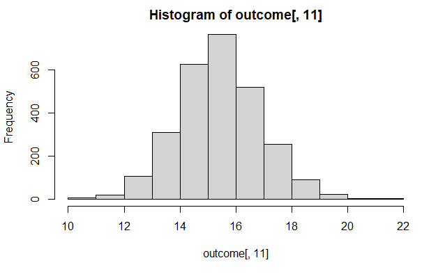

# 1 Plot the 30-day mortality rates for heart attack

Read the outcome data into R via the read.csv function and look at the first few rows.
```R
> outcome <- read.csv("outcome-of-care-measures.csv", colClasses = "character")
> head(outcome)
```

There are many columns in this dataset. You can see how many by typing ncol(outcome) (you can see the number of rows with the nrow function). In addition, you can see the names of each column by typing names(outcome) (the names are also in the PDF document. 

To make a simple histogram of the 30-day death rates from heart attack (column 11 in the outcome dataset),
run
```R
> outcome[, 11] <- as.numeric(outcome[, 11])
> ## You may get a warning about NAs being introduced; that is okay
> hist(outcome[, 11])
1
```
Because we originally read the data in as character (by specifying colClasses = "character" we need to coerce the column to be numeric. You may get a warning about NAs being introduced but that is okay.


```{r}
outcome <- read.csv("../data/outcome-of-care-measures.csv", colClasses = "character")
head(outcome)
```

```{r}
outcome[, 11] <- as.numeric(outcome[, 11])
hist(outcome[, 11])
```



